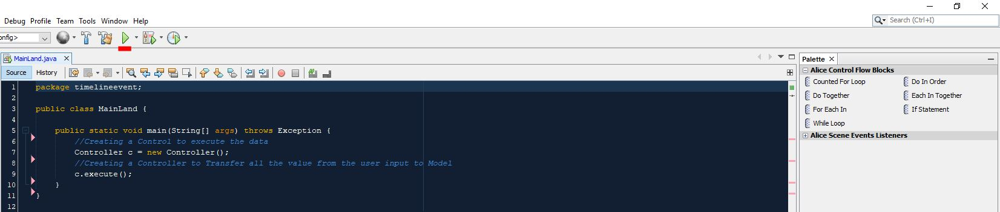
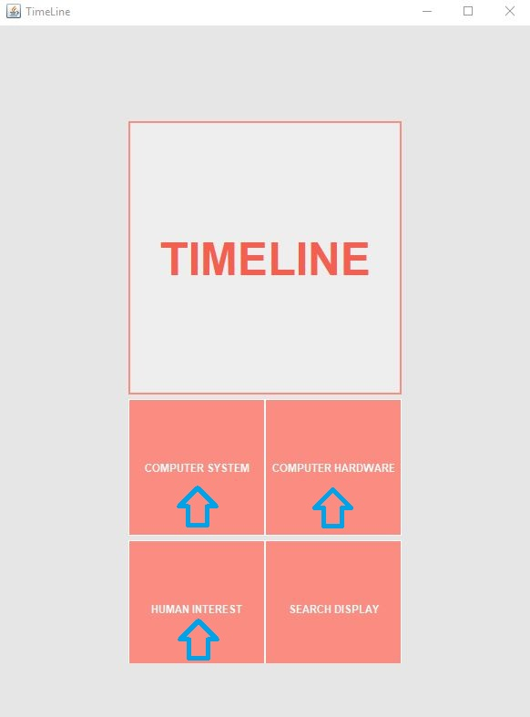

# Model-View-Controller Simulation

Design patterns are approaches to software development that are optimized for individual use case. A design pattern could be as simple as

## Designed for CIT-115

### STEP 1: Finding the MainLand method

    package timelineevent;

    public class MainLand {

        public static void main(String[] args) throws Exception {
            //Creating a Control to execute the data
            Controller c = new Controller();
            //Creating a Controller to Transfer all the value from the user input to Model
            c.execute();
        }
    }

### STEP 2: Cliking the Run button

### STEP 3: GUI is HERE! Choosing the choice that you want to RECORD!

