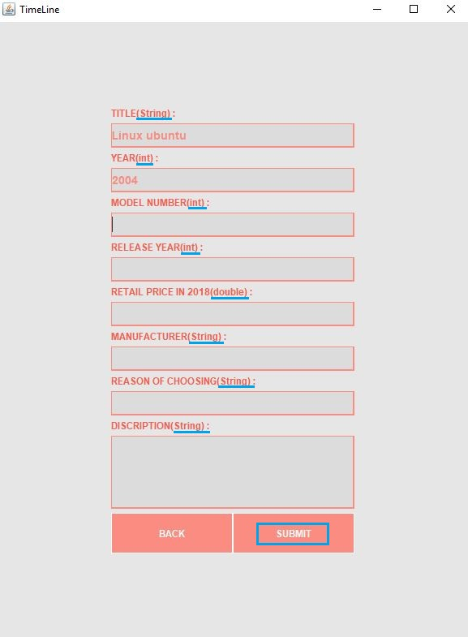
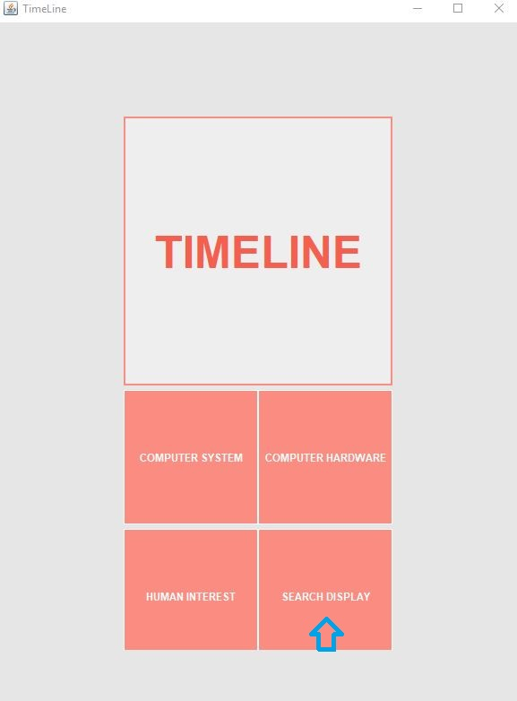
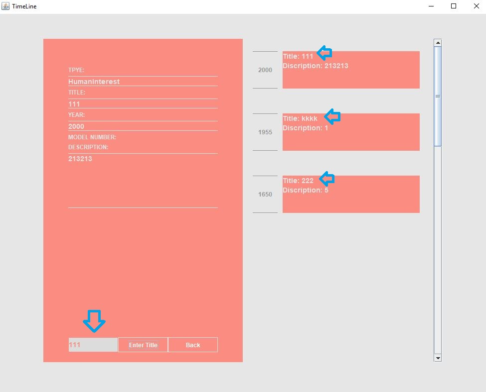
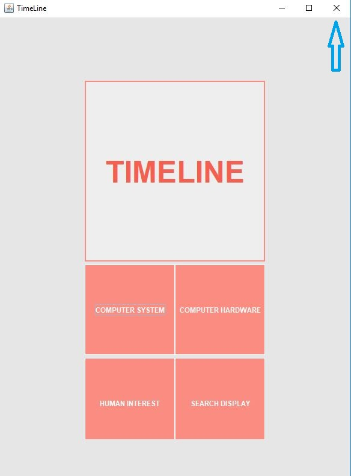

# Model-View-Controller Simulation

Application about Timeline Event: Record, Display and Retrieve

## Designed for CIT-115

### STEP 1: Finding the MainLand method

    package timelineevent;

    public class MainLand {

        public static void main(String[] args) throws Exception {
            //Creating a Control to execute the data
            Controller c = new Controller();
            //Creating a Controller to Transfer all the value from the user input to Model
            c.execute();
        }
    }

### STEP 2: Cliking the Run button

### STEP 3: GUI is HERE! Choosing the choice that you want to RECORD!

### STEP 4: Input the data about TimeLine Component! Take care to the Value Tpye!(You can try a WRONG type, "Surprise" will occur)Then click the SUBMIT button!(If you don't want to save it, click the Back button)

### STEP 5: When you submit the information, it will back to the main page. You could choose the Choice again or you could SEARCHING THE TIMELINE DISPLAY

### STEP 6: Display the Timeline Event! Right Panel is about ordered Timeline Event. Left Panel is about the details. If you want to look into the details about each Timeline Event, input the TITLE name in the end of the Left Panel and click the Button of "Enter Title". If you want to back to main page and input again, click the Button of "Back".

### STEP 7: Close the Application

### STEP 8: Run the Application AGAIN! See what happens!
